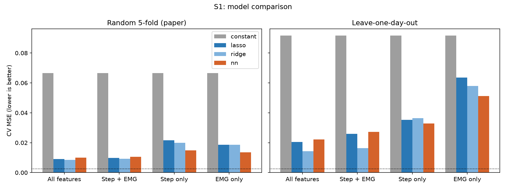
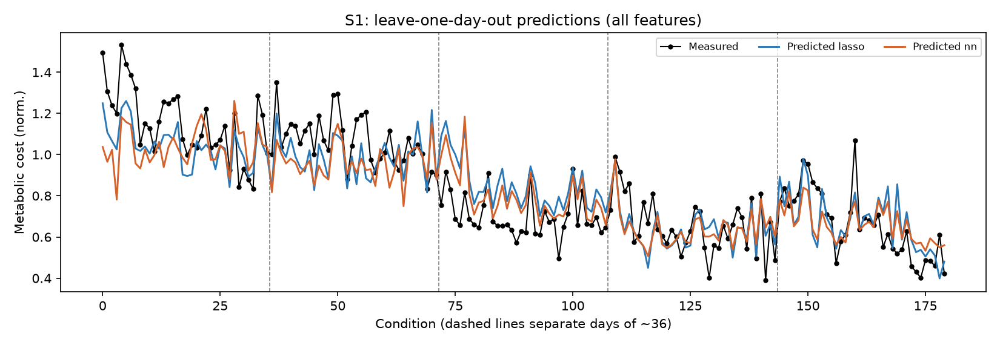

# Predicting Metabolic Cost During Human-in-the-Loop Optimization

**UE24CS352A Machine Learning - Mini Project, Team 13 (Problem 18)**

| Member | USN | Responsibility |
|---|---|---|
| Manav Dewangan | PES2UG24CS262 | Data loading, evaluation protocols (k-fold + leave-one-day-out), baselines, EDA |
| Lakshmi Narasimha Moorty Perepa | PES2UG24CS248 | Neural network, nested tuning, feature selection / PCA, experiments, live demo |

## Problem

Human-in-the-loop optimisation (HILO) tunes an ankle exoskeleton's controller while a person walks,
using **metabolic cost** as the objective. Metabolic cost is slow to settle, noisy and needs a
breathing mask in a lab. We predict it from signals that can be measured outside the lab - gait
features and surface EMG - plus the exoskeleton's control parameters.

This project re-implements and extends the CS229 study by Krimsky & Ng (2018) in Python:

* **Reproduction** - LASSO baseline and a one-hidden-layer tanh neural network, compared on four
  feature sets (all, step + EMG, step only, EMG only) with the paper's random k-fold protocol.
* **Extension: leave-one-day-out CV** - train on four walking days and test on a fifth, unseen
  day, the stricter test the paper proposed as future work.
* **Leak-free pipelines** - scaling, hyper-parameter tuning, feature selection and PCA are all fitted
  inside each training fold (the reference code fitted them on the full dataset).

## Dataset

Two subjects x 5 days x 36 controller settings (180 samples per subject, 179 for S2 after removing
one invalid row), 29 features: 9 step features, 16 EMG channels, 4 control parameters. The target is
metabolic cost normalised to normal walking. See [data/README.md](data/README.md).

## Repository layout

```
data/            processed_data.mat + description
src/
  config.py      paths, subjects, feature groups, constants
  data.py        load_subject() -> SubjectData (X, y, day, feature names)
  evaluation.py  k-fold and leave-one-day-out cross-validation, metrics
  baselines.py   constant, LASSO, Ridge
  eda.py         exploratory plots
  models.py      neural network, nested hyper-parameter tuning, neuron sweep
  feature_selection.py  nested forward selection and PCA
  viz.py         result plots
scripts/
  run_experiments.py   runs every experiment -> results/tables/*.csv, results/figures/*.png
notebooks/
  01_eda.ipynb               data exploration
  02_baselines.ipynb         baselines, CV protocols, leakage check
  03_models_and_results.ipynb  neural network, selection, PCA, discussion
  04_live_demo.ipynb         the notebook used for the live demonstration
tests/           pytest unit tests
report/          write-up (LaTeX + PDF) and slides
```

## Setup

Requires Python 3.10+ (tested on 3.11).

```bash
git clone <repo-url>
cd hilo-metabolic-cost
python -m venv .venv
# Windows:  .venv\Scripts\activate
# macOS/Linux: source .venv/bin/activate
pip install -r requirements.txt
```

## How to run

```bash
pytest                                   # unit tests (~15 s)
python -m scripts.run_experiments        # all experiments (~5 min) -> results/
python -m scripts.run_experiments --quick  # fast smoke test (~2 min)
jupyter notebook notebooks/              # open the notebooks
```

The results in `results/` are committed, so the notebooks can be opened without re-running the
experiments. For the live demo open `notebooks/04_live_demo.ipynb` and run all cells (~1 min).

## Results

<!-- RESULTS:START -->
Cross-validated MSE of normalised metabolic cost using all 29 features
(`results/tables/model_comparison.csv`; noise floor of the measurement is about 0.0025).

| Subject | Model | Random 5-fold | Leave-one-day-out | Paper (5-fold) |
|---|---|---|---|---|
| S1 | Constant | 0.0666 | 0.0917 | 0.0657 |
| S1 | LASSO | 0.0091 | 0.0205 | 0.0089 |
| S1 | Ridge | 0.0086 | **0.0143** | - |
| S1 | Neural net (nested-tuned) | 0.0101 | 0.0223 | 0.0089 |
| S2 | Constant | 0.0362 | 0.0478 | 0.0465 |
| S2 | LASSO | 0.0135 | **0.0309** | 0.0176 |
| S2 | Ridge | 0.0146 | 0.0358 | - |
| S2 | Neural net (nested-tuned) | 0.0150 | 0.0315 | 0.0301 |

Key findings:

1. With the paper's random k-fold protocol we reproduce its accuracy (S1 LASSO 0.0091 vs 0.0089).
2. Predicting an **unseen day** roughly doubles the error - day-to-day adaptation of the subject is
   the main obstacle, and random k-fold over-states real-world accuracy.
3. With all features, regularised linear models are as accurate as the shallow neural network;
   the network only helps on the small step-only / EMG-only feature sets.
4. Step + EMG beats either group alone; control parameters help noticeably under leave-one-day-out.
5. Nested forward selection and PCA do not beat the full regularised models.



<!-- RESULTS:END -->

## Reference

E. Krimsky and E. Ng, "Predicting Metabolic Cost During Human-in-the-Loop Optimization", CS229
project report, Stanford University, 2018. Original MATLAB code: https://github.com/ngeley/cs229project
